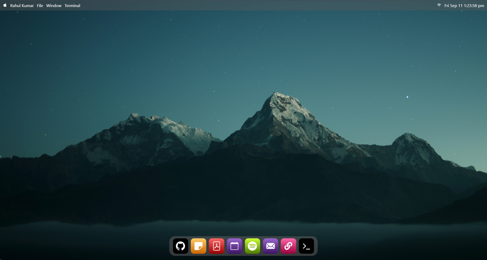
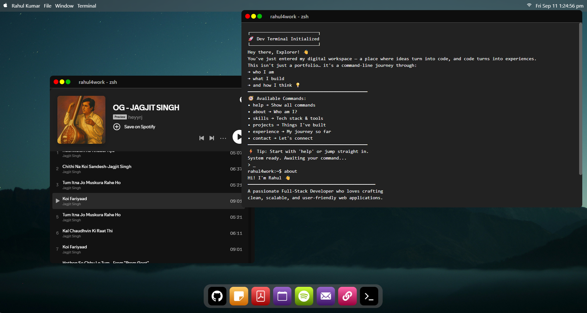
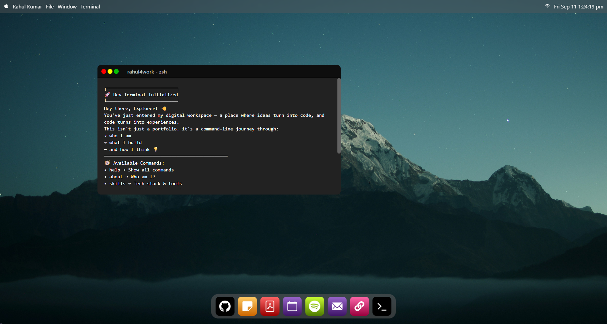

# 🖥️ macOS Portfolio

> An interactive macOS-inspired developer portfolio that transforms a traditional portfolio into a functional desktop experience.

🌐 **Live Demo:** [macOS Portfolio](https://mac-os-portfolio-mu-five.vercel.app/)

---

## 📌 Overview

macOS Portfolio is a personal developer portfolio built with React.js and Vite that recreates the experience of interacting with a macOS-style desktop directly inside the browser.

Instead of presenting information through a conventional portfolio layout, the application organizes professional information into interactive desktop applications.

Visitors can open different applications from the dock to explore projects, read professional information, view the resume, listen to a Spotify playlist, access social profiles, and interact with a built-in terminal.

The goal of the project is to combine a professional developer portfolio with an interactive desktop-style user experience.

---

## ✨ Highlights

- macOS-inspired desktop interface
- Interactive top navigation bar
- Dynamic date and time
- macOS-style application dock
- Interactive application windows
- Draggable and resizable windows
- Multiple applications can be opened independently
- Built-in developer terminal
- GitHub project explorer
- Developer profile notes
- Embedded resume viewer
- Spotify playlist integration
- Google Calendar integration
- Email integration
- LinkedIn integration
- Responsive desktop-oriented UI
- Component-based React architecture

---

## 📸 Preview


| | |
|---|---|
| Home Page |  Multiple Applications |

### Interactive Terminal
| | |
|---|---|
| Interactive Terminal | |


---

## 🧩 Applications

| Application | Description |
|------------|-------------|
| 🐙 GitHub | Displays selected projects and repository links |
| 📝 Notes | Displays my developer profile, skills, experience, projects, and professional information |
| 📄 Resume | Embedded PDF resume viewer |
| 📅 Calendar | Opens Google Calendar |
| 🎵 Spotify | Embedded Spotify playlist |
| ✉️ Mail | Opens the default email client |
| 🔗 LinkedIn | Opens my LinkedIn profile |
| 💻 Terminal | Interactive command-line interface for exploring my portfolio |

---

## 🐙 GitHub Application

The GitHub application provides an interactive project explorer containing selected projects from my GitHub profile.

Each project can display:

- Project preview image
- Project name
- Project description
- Technology stack
- Repository link
- Live demo link when available

### Featured Projects

- SnitchClone
- PerplexityClone
- Estate
- FitX
- UberClone

GitHub:

[rahul4work](https://github.com/rahul4work)

---

## 📝 Notes Application

The Notes application presents my professional profile in a developer-oriented JavaScript configuration format.

The displayed information includes:

- Professional summary
- Technical skills
- Work experience
- Projects
- Education
- Certifications
- Achievements
- Contact information
- Current career focus

The content is maintained in:

```text
src/assets/note.txt